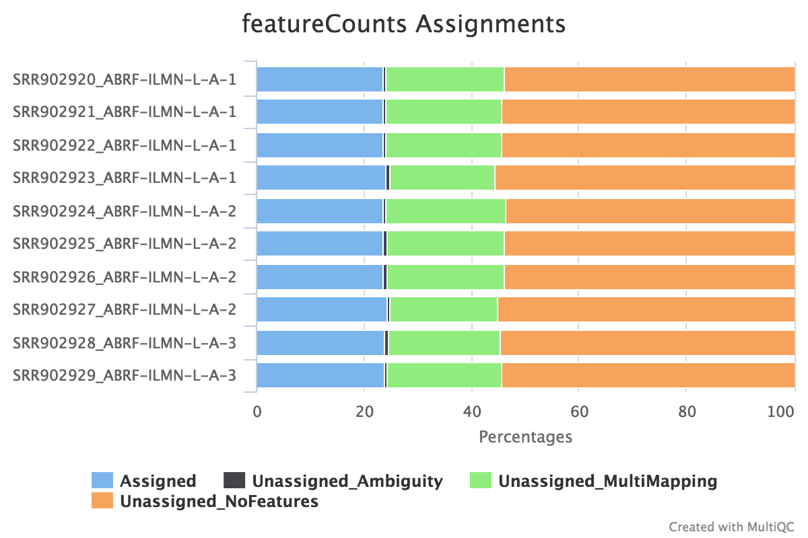
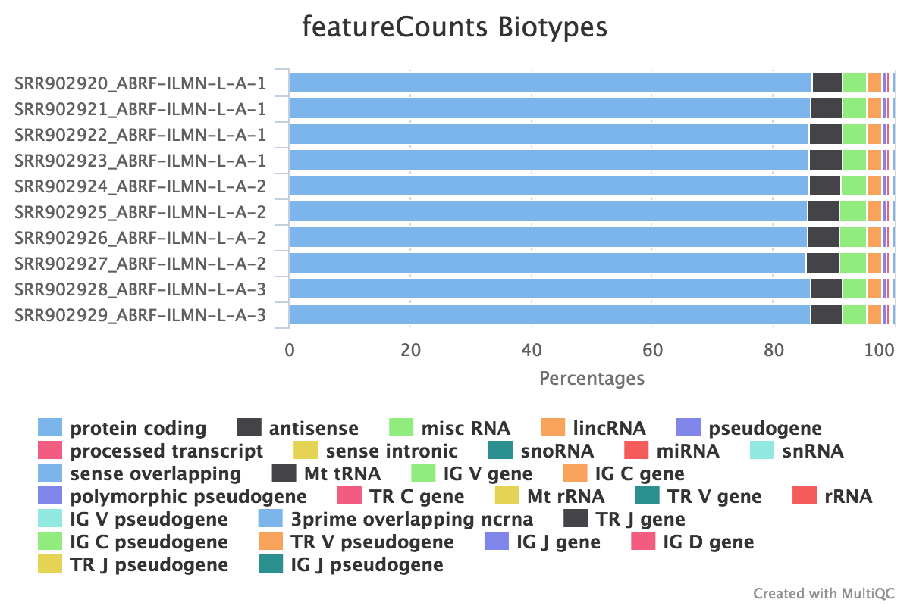

# ICGC-FeatureCounts
This pipeline takes some BAM files from ICGC and runs featureCounts on them.

This document describes the output produced by the pipeline. Most of the plots are taken from the MultiQC report, which summarises results at the end of the pipeline. Documentation for the [featureCounts](#featurecounts) part taken from [nf-core/RNAseq](https://github.com/nf-core/RNAseq), written by Rickard Hammaren and Phil Ewels.

## Pipeline overview
The pipeline is built using [Nextflow](https://www.nextflow.io/)
and processes data using the following steps:

* [featureCounts](#featurecounts) - gene counts, biotype counts, rRNA estimation.
* [MultiQC](#multiqc) - aggregate report, describing results of the whole pipeline

## featureCounts
[featureCounts](http://bioinf.wehi.edu.au/featureCounts/) from the subread package summarises the read distribution over genomic features such as genes, exons, promotors, gene bodies, genomic bins and chromosomal locations.
RNA reads should mostly overlap genes, so be assigned.

We also use featureCounts to count overlaps with different classes of features. This gives a good idea of where aligned reads are ending up and can show potential problems such as rRNA contamination.

**Output directory: `results/featureCounts`**

* `Sample.bam_biotype_counts.txt`
  * Read counts for the different gene biotypes that featureCounts distinguishes.
* `Sample.featureCounts.txt`
  * Read the counts for each gene provided in the reference `gtf` file
* `Sample.featureCounts.txt.summary`
  * Summary file, containing statistics about the counts

## MultiQC
[MultiQC](http://multiqc.info) is a visualisation tool that generates a single HTML report summarising all samples in your project. Most of the pipeline QC results are visualised in the report and further statistics are available in within the report data directory.

**Output directory: `results/multiqc`**

* `Project_multiqc_report.html`
  * MultiQC report - a standalone HTML file that can be viewed in your web browser
* `Project_multiqc_data/`
  * Directory containing parsed statistics from the different tools used in the pipeline

For more information about how to use MultiQC reports, see http://multiqc.info
